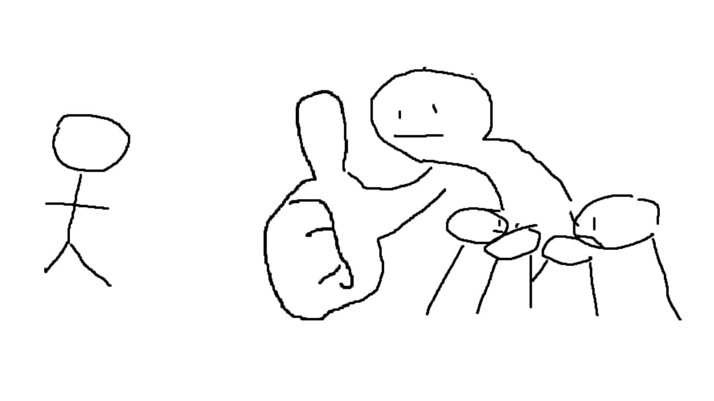

 # Hello, world! I am Ryan Ding, a student in Professor Joe Politz's CSE 15L class Winter Quarter 2023! This is a Heading 1!  
[Lab Report 1](https://ryanding26.github.io/cse15l-lab-reports/labReport1.html) [Other page I made that has nothing on it](https://ryanding26.github.io/cse15l-lab-reports/newPage.html)  

_Italics use one underscore at the beginning and end of the phrase you want to italicize_  
__Bolding is similar, but two underscores are used__  
*Italics* and **Bold** underscores can also use the star -> * symbol instead of the underscores!  
## This is a Heading 2; Each heading uses the pound symbol to denote a heading; The more pound symbols, the smaller the heading!
> "The '>' arrow denotes a blockquote. Pretend I am saying something really profound" -Ryan Ding  

* Unordered
* Lists
* Can 
* Use
* Star or Dash (-)
* Symbols!  

---
1. Ordered
2. Lists
3. Just
4. Use
5. Numbers  

***  

`Backticks` denote inline code  

```
code blocks like this can be created with 3 consecutive backticks or just a 4 space indent
```  
