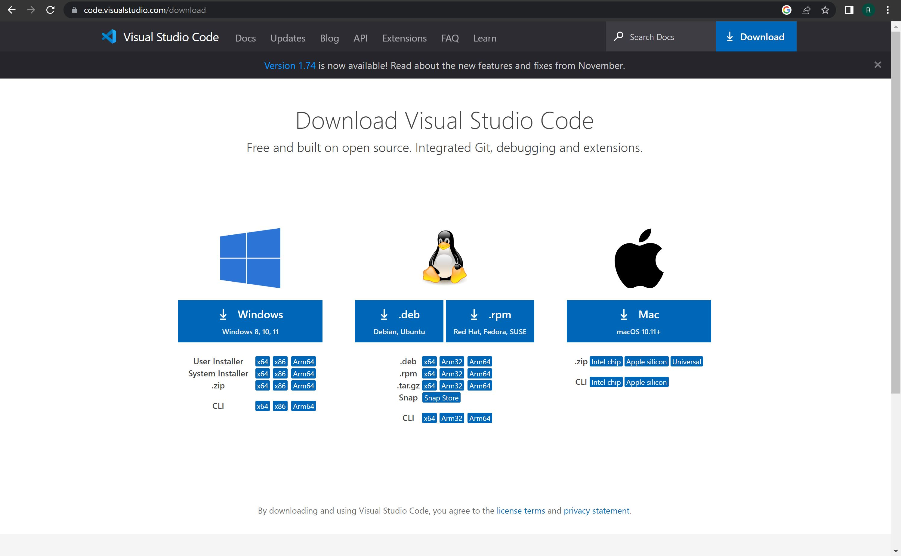
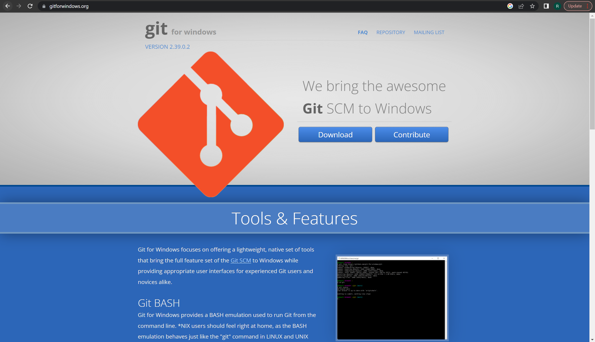
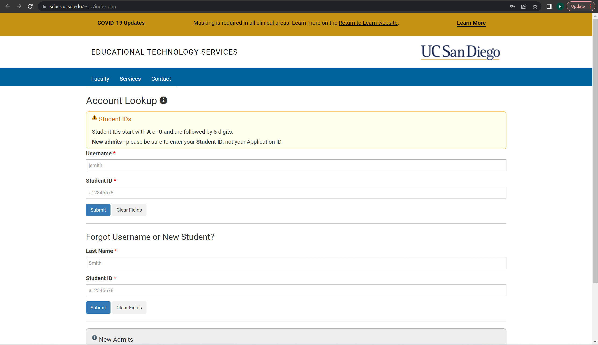
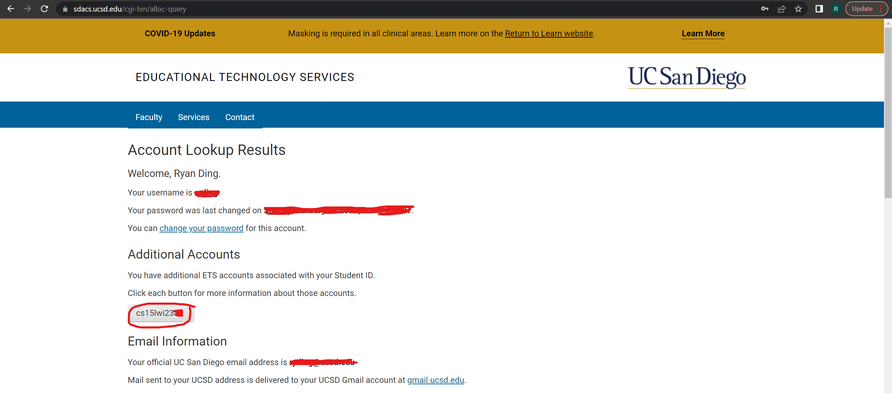
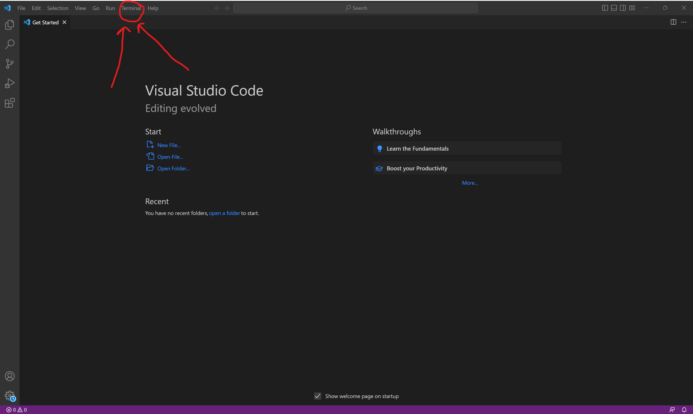
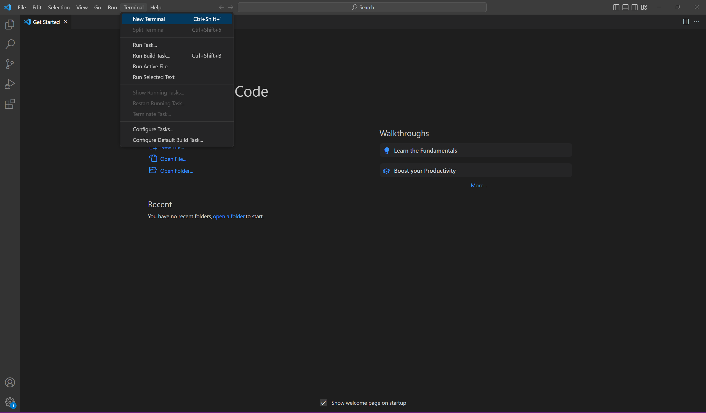
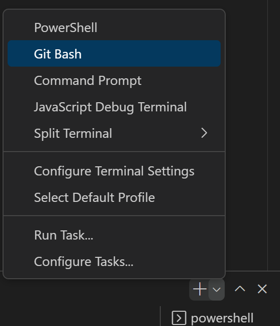
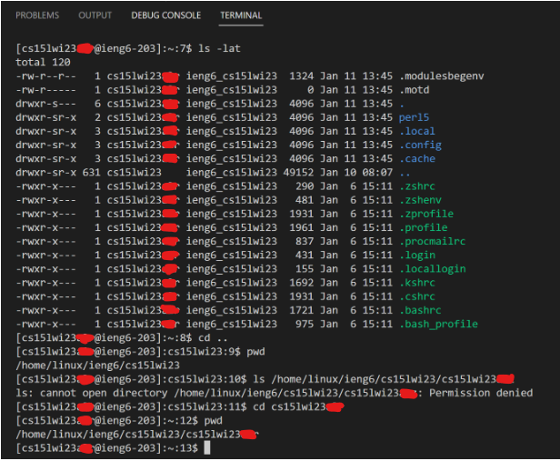

# Remotely Accessing a Course Specific Account on `ieng6`  
## Lab Report 1 | Ryan Ding    
### 1. Install Visual Studio Code onto your computer!  
This can be done rather easily by going to the [Visual Studio Code](https://code.visualstudio.com/download) website and downloading the software onto your computer. Remember to choose the version appropriate to your computer's operating system. For the sake of this tutorial, it will mainly be regarding the Windows installation of VS Code.  
 
    
### 2. Install Git onto your computer!  
Again, this step is insanely simple in the fact that all you need to do is install a software called [Git](https://gitforwindows.org/) at that link. This step is mainly needed for Windows users. Simply click the download button and go through the steps needed to install the software on your device of choice!  
 
  
***
#### Before continuing ahead...  
- Make sure that you have a valid CSE 15L account from Educational Technology Services by going to [this](https://sdacs.ucsd.edu/~icc/index.php) link and looking up your account:  
      
- Make sure that you have an account under the title of **cs15l**_xxxxyyy_, where _xxxx_ signifies the term you are on (for instance, the winter 2023 quarter would be _wi23_) and _yyy_ signifies your unique student login.   

#### Resetting your password  
If your login information does not work later on in this tutorial, more specifically at the point where entering your password into the terminal does not work, consider resetting your password:  
1. Click on the cs15lxxxxyyy user to select that ETS account (by default, your general, all-purpose ETS should be selected; make sure to do this!)
2. There should be a yellow popup with a password reset option; Click it and fill it out; Select `No` for __Change my TritonLink Password?__
3. Instead of clicking the `Check Password` button at the bottom of the screen, make sure that your cursor is active in the _Confirm Password_ text box and click `Enter`; your password should be updated within 15 minutes!
***
### 3. Remotely connect to the server via the integrated terminal!  
At this point, everything should be functional and setup correctly. Now we can move on to accessing the SSH, or the Secure Shell
 
Open an integrated terminal by clicking Terminal:  
  
Then, select New Terminal:  
  
 
After the terminal window is open, there are a few things that need to be done to use Git Bash, which is required to connect to the Secure Shell. Click the dropdown arrow next to the plus sign to show the various terminal options, and select Git Bash:  
  
Ensure that the terminal selected is __NOT__ PowerShell, but rather Git Bash, so that a screen like this pops up:  
  

After all this, type `ssh [username]@ieng6.ucsd.edu` in order to enter the Secure Shell.  
- If this is your first time doing such a connection, you will then be prompted with a question asking if you would like to continue to connect, to which you should type `yes` to.  

Finally, enter the password that you created for the _cs15lxxxxyyy_ Educational Technology Services account in order to enter the Secure Shell.  
- Note that keys you type will not show up on the screen as an added security measure; make sure you type your password in precisely!  

Congrats, you are now inside the Secure Shell! You should see this screen:  
  
You may now enter in a variety of commands that you would like to use! Here is a sample of some commands I used:  
  
> Context: I first ran ls -lat to list the -lat path. Then, I changed the directory from my personal directory to the parent directory, cs15lwi23, using “..” (this changes the current directory to that of the parent directory). I then printed the working directory to the terminal to check it, and then tried to access my lab group member's directory from my terminal, which did not work, as anticipated, since I did not have the permission. Finally, I changed the directory back to my own personal one and then printed the working directory out the final time to check my changes.  

Here are some interesting commands that you can start out with:
- `cd`: changes the directory of the user  
- `ls <directory>`: lists all the files in a directory; if no directory is stated, it will list the current directory  
- `cat <directory>`: prints all files in the directory specified to the terminal  

# Happy Coding!
