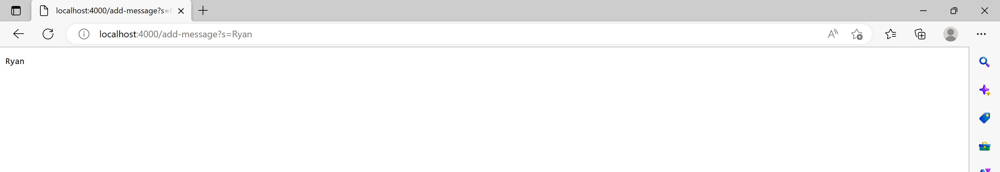
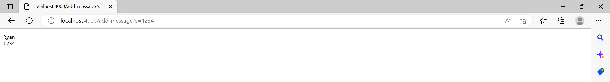
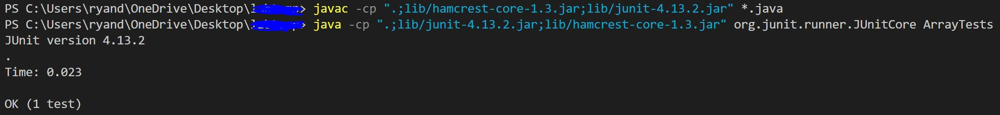
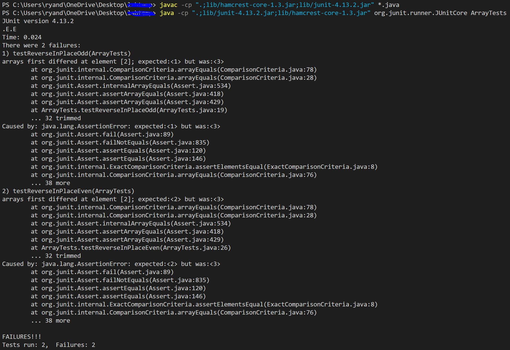

# Lab Report 2 (Week 3)  
## Part 1: StringServer
Code for StringServer.java:  
```
import java.io.IOException;
import java.net.URI;


class Handler implements URLHandler {
    // The one bit of state on the server: a number that will be manipulated by
    // various requests.
    String[] words = new String[1000];
    int size = 0;

    public String handleRequest(URI url) {
        String printedWords = "";
        if (url.getPath().equals("/")) {
            for(int i = 0; i < size; i++) {
                printedWords = printedWords.concat(words[i]);
                printedWords = printedWords.concat("\n");
            }
            return printedWords;
        } else {
            if (url.getPath().contains("/add-message")) {
                String[] parameters = url.getQuery().split("=");
                if (parameters[0].equals("s")) {
                    for(int i = 0; i < words.length; i++) {
                        if (words[i] == null) {
                            words[i] = parameters[1];
                            size++;
                            break;
                        }
                    }
                    for(int i = 0; i < size; i++) {
                        printedWords = printedWords.concat(words[i]);
                        printedWords = printedWords.concat("\n");
                    }
                    return printedWords;
                }
            }
        }
        return "404 Not Found!";
    }
}

class StringServer {
    public static void main(String[] args) throws IOException {
        if(args.length == 0){
            System.out.println("Missing port number! Try any number between 1024 to 49151");
            return;
        }

        int port = Integer.parseInt(args[0]);

        Server.start(port, new Handler());
    }
}
```  
Code for the supporting Server.java file, provided by Professor Politz:  
```
// A simple web server using Java's built-in HttpServer

// Examples from https://dzone.com/articles/simple-http-server-in-java were useful references

import java.io.IOException;
import java.io.OutputStream;
import java.net.InetSocketAddress;
import java.net.URI;

import com.sun.net.httpserver.HttpExchange;
import com.sun.net.httpserver.HttpHandler;
import com.sun.net.httpserver.HttpServer;

interface URLHandler {
    String handleRequest(URI url);
}

class ServerHttpHandler implements HttpHandler {
    URLHandler handler;
    ServerHttpHandler(URLHandler handler) {
      this.handler = handler;
    }
    public void handle(final HttpExchange exchange) throws IOException {
        // form return body after being handled by program
        try {
            String ret = handler.handleRequest(exchange.getRequestURI());
            // form the return string and write it on the browser
            exchange.sendResponseHeaders(200, ret.getBytes().length);
            OutputStream os = exchange.getResponseBody();
            os.write(ret.getBytes());
            os.close();
        } catch(Exception e) {
            String response = e.toString();
            exchange.sendResponseHeaders(500, response.getBytes().length);
            OutputStream os = exchange.getResponseBody();
            os.write(response.getBytes());
            os.close();
        }
    }
}

public class Server {
    public static void start(int port, URLHandler handler) throws IOException {
        HttpServer server = HttpServer.create(new InetSocketAddress(port), 0);

        //create request entrypoint
        server.createContext("/", new ServerHttpHandler(handler));

        //start the server
        server.start();
        System.out.println("Server Started! Visit http://localhost:" + port + " to visit.");
    }
}
```  
### Usages
#### Sample 1: /add-message?s=Ryan  
 
What this did is that it added my name, Ryan, to the array of messages present within the code. First and foremost, the server was booted up with port 4000 on the local host. In the handler class, the getPath method was invoked on the URI `url` object, checking that the path was simply "/", meaning that no query was made. In our case, the path was more than the "/", so the else part of the if-else statement executed. It then checked if the path contained "/add-message", as it was needed to specify that a certain string was to be added to the display. It also needed to check for the query string, and split the two halves of the "s=Ryan" url by its delimiter "=" (Note: getQuery takes into account the url right after the question mark symbol). Whatever was after the equals sign was the string assigned to the string array words (which is shown as parameters[1] in the code), and the size integer variable was incremented by one to indicate that another string was added to the list of words, being displayed on the screen in the process as the contents of the array were returned to the function and printed on the local host screen.
#### Sample 2: /add-message?s=1234  
  
While appearing to be an integer instead of a string value, it actually reads the number 1234 as the string literal, "1234", into the words string array and went through quite literally the exact same process as the first sample. In a way, adding any message to the words array will change the size variable by incrementing it by one, the words array (by adding a new non-null element to it), and the printedWords variable (based off the contents of the words array).

## Part 2: ArrayExamples and ArrayTests Case Analysis  
This section will go over the ArrayExamples and ArrayTests files provided to us in the lab3 repository, and will go over the various inputs, tweaks, and test methods that were present for the reverseInPlace function
Failed tests for reverseInPlace:  
Checks the reverseInPlace function with both an even and odd-length array;  
Failure-inducing inputs: the length 4 and length 3 input1 array in both test methods:  
```
@Test
public void testReverseInPlaceEven() {
  int[] input1 = { 1, 2, 3, 4 };
  ArrayExamples.reverseInPlace(input1);
  assertArrayEquals(new int[]{ 4, 3, 2, 1 }, input1);
}

@Test
public void testReverseInPlaceOdd() {
  int[] input1 = { 1, 2, 3 };
  ArrayExamples.reverseInPlace(input1);
  assertArrayEquals(new int[]{ 3, 2, 1}, input1);
}  
```  
Not a failure-inducing input: the length 1 input1 array in the following test methods:  
```
@Test
public void testReverseInPlace() {  
  int[] input1 = { 3 };  
  ArrayExamples.reverseInPlace(input1);  
  assertArrayEquals(new int[]{ 3 }, input1);
}
```  
Symptoms of the testReverseInPlace (No failures):  
  
Symptoms of the testReverseInPlaceEven and testReverseInPlaceOdd (failures):  
  
**Why the failure-inducing inputs failed (expected vs actual values)**: For testReverseInPlaceOdd, the 
The only test that was able to pass with the initial code was testReverseInPlace, whereas the other test methods produced an error in the way that the expected value, being the content of the array, was not the actual value upon the methods being called.
Code before changes were made to fix it:  
```
static void reverseInPlace(int[] arr) {
  for(int i = 0; i < arr.length; i += 1) {
    arr[i] = arr[arr.length - i - 1];
  }
}
```  
Code after it was fixed:  
```
static void reverseInPlace(int[] arr) {
  for(int i = 0; i < arr.length / 2; i += 1) {
    int temp = arr[i];
    arr[i] = arr[arr.length - i - 1];
    arr[arr.length - i - 1] = temp;
  }
}
```  
**What was done to fix it**: A temporary integer variable in the loop of the function was created to capture arr[i] before arr[i] was reassigned to the value of arr[arr.length - i - 1], since then the original arr[i] value will not be overwritten/lost.  Additionally, the loop was stopped halfway through the length of the array instead of iterating through the entire array, so that the array does not end up being the same as it was initially at the end.  

## Part 3: Learning Outcomes  
For me, I was entirely new to the concept of servers, and fairly new to JUnit testing of code. In fact, the first that I had heard of it was the course that we were required to concurrently enroll in with CSE 15L, CSE 12, this quarter. In terms of other things that I learned, working with GitHub Desktop for the first time was really nice, as I did not know it would be so easy to commit and push changes to my code in repositories to the website. The servers were the most interesting part of these past two weeks, and I hope that I am able to work more with them in the future as they are loads of fun to play with in general.  
# Happy Coding!
