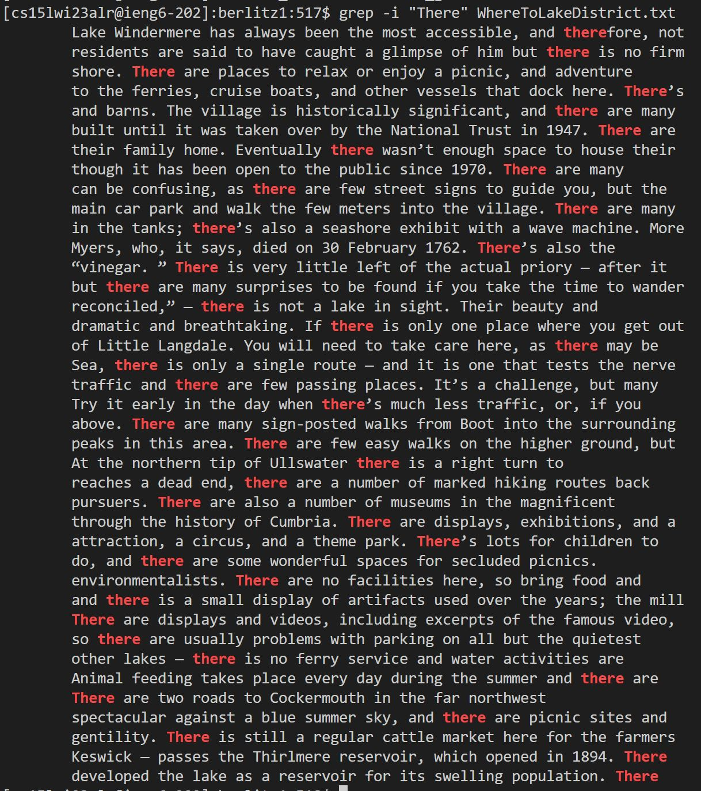
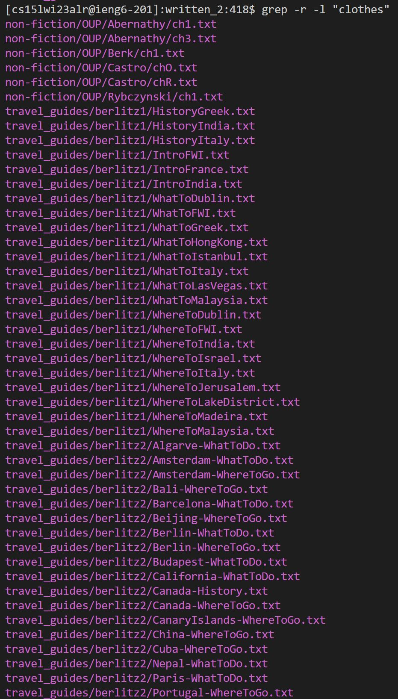
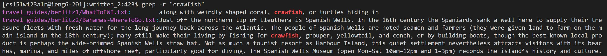
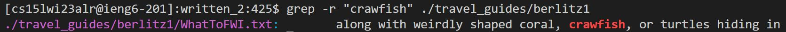
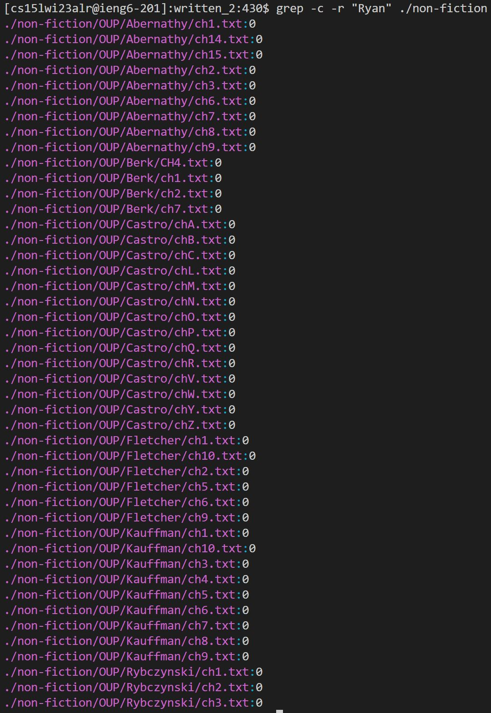
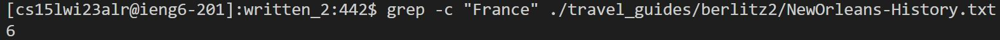
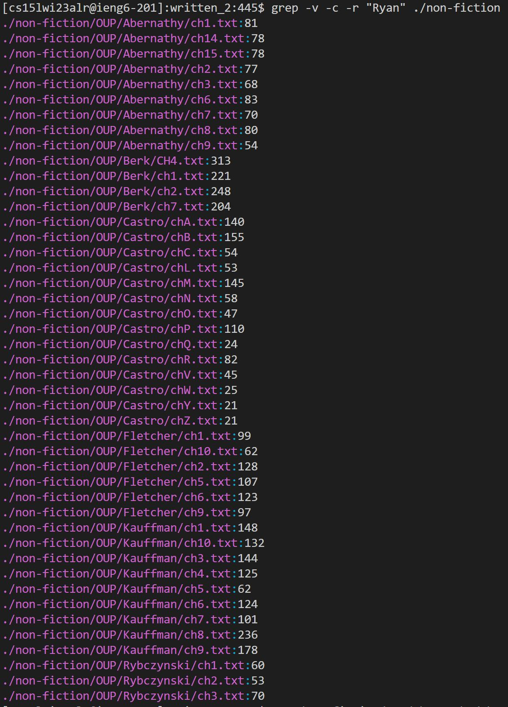

# Lab Report 3 | Ryan Ding  
## Different Ways to Use Grep  
There are many ways for us to use grep, a command short for **Global Regular Expression Print**, from the ways with which Professor Politz taught us in lecture to other ways that can be found online. In this lab report, I will go into the different commands that grep has to offer that may be of essential use in a future Skill Demostration, lab assignment, or just casual use! All examples will be going through the written_2 folder provided in the [Skill Demonstration 1 Data Repository](https://github.com/ucsd-cse15l-w23/skill-demo1-data). Keep in mind that in these examples, should nothing be printed to the command line, there are either no results to be found using the command or the command was not used in a proper way.  
### 1. Searching for a specific string within a file
Searching for a specific string within a file is as easy as 1-2-3! Use the following syntax to search for a particular string within a specific file or even an entire directory:  
`grep <<Modifiers>> <<String query>> <<Specified Directory>>`  
While modifiers are also an essential part of scraping just the information needed for a specific task, they will only be touched upon briefly in different examples, allowing us to pick and choose what piece of information is printed to the command line. However, in these next two examples, they will not be used.  
#### Example 1: Looking for the string "Cuba" within a specific file  
In running the command `grep "Cuba" <<file name>>`, we are able to check as to whether or not the chosen file contains the string "Cuba." Without any modifiers, the terminal will print out a short excerpt of the file with the specified string. For instance, when we check for the string "Cuba" within the Vallarta-WhatToDo.txt file, we can seen where it is mentioned:  
  
Command Syntax: `grep "Cuba" Vallarta-WhatToDo.txt` from within the `berlitz2` directory.  
#### Example 2: Looking for the string "Rainy" within a specific file  
Again, this example is similar to the one above, except that it searches for the string "Rainy" to see if it is located within the specific file WhatToLakeDistrict.txt. While these methods do seem inefficient should a large number of files need to be checked, there will be different and better ways to cover a large amount of files later on in this report, such as through recursive searching and the usage of different parameters.
  
Command Syntax: `grep "Rainy" WhatToLakeDistrict.txt` from within the `berlitz1` directory.  
### 2. Recursively searching through multiple directories  
The recursive modifier of grep, denoted as `-r`, allows for multiple files within the local and even deeper directories to be searched to return a specific query. This was an essential modifier to use for our past skill demonstration, as written_2 possessed layers of varying depths of directory upon directory that needed to be scanned to complete specific tasks. The modifier searches everything within the local directory and everything below it. The syntax is as such:  
`grep -r <<Other Modifiers>> <<Specified String>> <<Given File/Directory>>`  
#### Example 1: Finding all the file names containing "clothes" in the entirety of written_2  
In this example, we will introduce the usage of the `-l` modifier as well, which is used to display just the file names of the query given to the Git Bash terminal. With this, every single file that contains the string "clothes", not containing any excerpt, can efficiently be printed towards the screen! Note that since no directory or file name is specified, the local directory will be given as a default. However, in this case, since we are already searching under everything in written_2, it would be redundant to write it out:  
  
Command Syntax: `grep -r -l "clothes"` from within the `written_2` directory.  
#### Example 2: Finding the files (w/ excerpts) containing "crawfish" in berlitz1  
Instead of looking just through written_2, we are able to specify the directory of recursion, with this time being within the berlitz1 directory. As can be seen, if we were to search in the entirety of written_2 as before, we would get two results:  
  
However, when the directory is specified after the string as berlitz1, the following shows instead:  
  
Command Syntax: `grep -r "crawfish ./travel_guides/berlitz1` from within the `written_2` directory.  
### 3. Counting the number of files with a given search query  

(REVISION) The `-c` modifier is used to count the number of instances that a given search query pops up within a specified file or directory. It works similarly to the basic grep command, except that `-c` does not provide the user with an excerpt of where a certain word or phrase pops up, and only displays the number of times it pops up in the given file, making it more compact to display the number of mentions a certain word has in a file. The formal syntax for this usage is:  
`grep -c <<Other Modifiers>> <<Specified String>> <<Given File/Directory>>  `
#### Example 1: Finding the number of mentions of "Ryan" within the non-fiction directory  
In this example, we will be using the `-c` modifier required for returning the count of a specific string in a specific directory. As such, my name will be used as the string parameter passed to the terminal, and in this case we see that sadly, no file has mentioned me, meaning that I am in fact not nonfiction :(  
  
Command Syntax: `grep -c -r "Ryan" ./travel_guides/non-fiction` from within the `written_2` directory.  
#### Example 2: Finding the number of mentions of "France" within a singular file  
As we have often been using the recursive modifier to look through many different files, let us check within a singular file once more for the amount of times France is mentioned in the file NewOrleans-History.txt. As it should be mentioned a few times, given that New Orleans has its root in the French, we can see that it can be found six times throughout the .txt file:  
    
Command Syntax: `grep -c -r "France" ./travel_guides/berlitz2/NewOrleans-History.txt` from within the `written_2` directory.  
### 4. Searching files that do NOT match a pattern  
In all the other examples, we have tried to find the files and locations of everything that contained a specific string. However, what if we want every file that DID NOT contain a specific string? (REVISION) This would be useful if there is an abundant amount of one string, and you wanted to find everything WITHOUT said string in it. Additionally, it is a good way to see which files have contents devoid of a specific topic by filtering it out with a specified string. With this, we introduce the inverse modifier, `-v`, used to return everything that does not match a query given to the terminal. The syntax for this is as follows:  
`grep -v <<Other Modifiers>> <<String query>> <<Specified File/Directory>>`  
#### Example 1: Method 2.1, but with the inverse modifier  
Going back to a previous example already used to show how -v works, we are going to search for all files that **DO NOT** contain the string "clothes" from within the written_2 directory:  
 ```
// This was printed as it was too large of an output to fit into one screenshot  
[cs15lwi23alr@ieng6-201]:written_2:443$ grep -v -r -l "clothes"
non-fiction/OUP/Abernathy/ch1.txt
non-fiction/OUP/Abernathy/ch14.txt
non-fiction/OUP/Abernathy/ch15.txt
non-fiction/OUP/Abernathy/ch2.txt
non-fiction/OUP/Abernathy/ch3.txt
non-fiction/OUP/Abernathy/ch6.txt
non-fiction/OUP/Abernathy/ch7.txt
non-fiction/OUP/Abernathy/ch8.txt
non-fiction/OUP/Abernathy/ch9.txt
non-fiction/OUP/Berk/CH4.txt
non-fiction/OUP/Berk/ch1.txt
non-fiction/OUP/Berk/ch2.txt
non-fiction/OUP/Berk/ch7.txt
non-fiction/OUP/Castro/chA.txt
non-fiction/OUP/Castro/chB.txt
non-fiction/OUP/Castro/chC.txt
non-fiction/OUP/Castro/chL.txt
non-fiction/OUP/Castro/chM.txt
non-fiction/OUP/Castro/chN.txt
non-fiction/OUP/Castro/chO.txt
non-fiction/OUP/Castro/chP.txt
non-fiction/OUP/Castro/chQ.txt
non-fiction/OUP/Castro/chR.txt
non-fiction/OUP/Castro/chV.txt
non-fiction/OUP/Castro/chW.txt
non-fiction/OUP/Castro/chY.txt
non-fiction/OUP/Castro/chZ.txt
non-fiction/OUP/Fletcher/ch1.txt
non-fiction/OUP/Fletcher/ch10.txt
non-fiction/OUP/Fletcher/ch2.txt
non-fiction/OUP/Fletcher/ch5.txt
non-fiction/OUP/Fletcher/ch6.txt
non-fiction/OUP/Fletcher/ch9.txt
non-fiction/OUP/Kauffman/ch1.txt
non-fiction/OUP/Kauffman/ch10.txt
non-fiction/OUP/Kauffman/ch3.txt
non-fiction/OUP/Kauffman/ch4.txt
non-fiction/OUP/Kauffman/ch5.txt
non-fiction/OUP/Kauffman/ch6.txt
non-fiction/OUP/Kauffman/ch7.txt
non-fiction/OUP/Kauffman/ch8.txt
non-fiction/OUP/Kauffman/ch9.txt
non-fiction/OUP/Rybczynski/ch1.txt
non-fiction/OUP/Rybczynski/ch2.txt
non-fiction/OUP/Rybczynski/ch3.txt
travel_guides/berlitz1/HandRHawaii.txt
travel_guides/berlitz1/HandRHongKong.txt
travel_guides/berlitz1/HandRIbiza.txt
travel_guides/berlitz1/HandRIsrael.txt
travel_guides/berlitz1/HandRIstanbul.txt
travel_guides/berlitz1/HandRJamaica.txt
travel_guides/berlitz1/HandRJerusalem.txt
travel_guides/berlitz1/HandRLakeDistrict.txt
travel_guides/berlitz1/HandRLasVegas.txt
travel_guides/berlitz1/HandRLisbon.txt
travel_guides/berlitz1/HandRLosAngeles.txt
travel_guides/berlitz1/HandRMadeira.txt
travel_guides/berlitz1/HandRMadrid.txt
travel_guides/berlitz1/HandRMallorca.txt
travel_guides/berlitz1/HistoryDublin.txt
travel_guides/berlitz1/HistoryEdinburgh.txt
travel_guides/berlitz1/HistoryEgypt.txt
travel_guides/berlitz1/HistoryFWI.txt
travel_guides/berlitz1/HistoryFrance.txt
travel_guides/berlitz1/HistoryGreek.txt
travel_guides/berlitz1/HistoryHawaii.txt
travel_guides/berlitz1/HistoryHongKong.txt
travel_guides/berlitz1/HistoryIbiza.txt
travel_guides/berlitz1/HistoryIndia.txt
travel_guides/berlitz1/HistoryIsrael.txt
travel_guides/berlitz1/HistoryIstanbul.txt
travel_guides/berlitz1/HistoryItaly.txt
travel_guides/berlitz1/HistoryJamaica.txt
travel_guides/berlitz1/HistoryJapan.txt
travel_guides/berlitz1/HistoryJerusalem.txt
travel_guides/berlitz1/HistoryLakeDistrict.txt
travel_guides/berlitz1/HistoryLasVegas.txt
travel_guides/berlitz1/HistoryMadeira.txt
travel_guides/berlitz1/HistoryMadrid.txt
travel_guides/berlitz1/HistoryMalaysia.txt
travel_guides/berlitz1/HistoryMallorca.txt
travel_guides/berlitz1/IntroDublin.txt
travel_guides/berlitz1/IntroEdinburgh.txt
travel_guides/berlitz1/IntroEgypt.txt
travel_guides/berlitz1/IntroFWI.txt
travel_guides/berlitz1/IntroFrance.txt
travel_guides/berlitz1/IntroGreek.txt
travel_guides/berlitz1/IntroHongKong.txt
travel_guides/berlitz1/IntroIbiza.txt
travel_guides/berlitz1/IntroIndia.txt
travel_guides/berlitz1/IntroIsrael.txt
travel_guides/berlitz1/IntroIstanbul.txt
travel_guides/berlitz1/IntroItaly.txt
travel_guides/berlitz1/IntroJamaica.txt
travel_guides/berlitz1/IntroJapan.txt
travel_guides/berlitz1/IntroJerusalem.txt
travel_guides/berlitz1/IntroLakeDistrict.txt
travel_guides/berlitz1/IntroLasVegas.txt
travel_guides/berlitz1/IntroLosAngeles.txt
travel_guides/berlitz1/IntroMadeira.txt
travel_guides/berlitz1/IntroMadrid.txt
travel_guides/berlitz1/IntroMalaysia.txt
travel_guides/berlitz1/IntroMallorca.txt
travel_guides/berlitz1/JungleMalaysia.txt
travel_guides/berlitz1/WhatToDublin.txt
travel_guides/berlitz1/WhatToEdinburgh.txt
travel_guides/berlitz1/WhatToEgypt.txt
travel_guides/berlitz1/WhatToFWI.txt
travel_guides/berlitz1/WhatToFrance.txt
travel_guides/berlitz1/WhatToGreek.txt
travel_guides/berlitz1/WhatToHawaii.txt
travel_guides/berlitz1/WhatToHongKong.txt
travel_guides/berlitz1/WhatToIbiza.txt
travel_guides/berlitz1/WhatToIndia.txt
travel_guides/berlitz1/WhatToIsrael.txt
travel_guides/berlitz1/WhatToIstanbul.txt
travel_guides/berlitz1/WhatToItaly.txt
travel_guides/berlitz1/WhatToJamaica.txt
travel_guides/berlitz1/WhatToJapan.txt
travel_guides/berlitz1/WhatToLakeDistrict.txt
travel_guides/berlitz1/WhatToLasVegas.txt
travel_guides/berlitz1/WhatToLosAngeles.txt
travel_guides/berlitz1/WhatToMadeira.txt
travel_guides/berlitz1/WhatToMalaysia.txt
travel_guides/berlitz1/WhatToMallorca.txt
travel_guides/berlitz1/WhereToDublin.txt
travel_guides/berlitz1/WhereToEdinburgh.txt
travel_guides/berlitz1/WhereToEgypt.txt
travel_guides/berlitz1/WhereToFWI.txt
travel_guides/berlitz1/WhereToFrance.txt
travel_guides/berlitz1/WhereToGreek.txt
travel_guides/berlitz1/WhereToHawaii.txt
travel_guides/berlitz1/WhereToHongKong.txt
travel_guides/berlitz1/WhereToIbiza.txt
travel_guides/berlitz1/WhereToIndia.txt
travel_guides/berlitz1/WhereToIsrael.txt
travel_guides/berlitz1/WhereToIstanbul.txt
travel_guides/berlitz1/WhereToItaly.txt
travel_guides/berlitz1/WhereToJapan.txt
travel_guides/berlitz1/WhereToJerusalem.txt
travel_guides/berlitz1/WhereToLakeDistrict.txt
travel_guides/berlitz1/WhereToLosAngeles.txt
travel_guides/berlitz1/WhereToMadeira.txt
travel_guides/berlitz1/WhereToMadrid.txt
travel_guides/berlitz1/WhereToMalaysia.txt
travel_guides/berlitz1/WhereToMallorca.txt
travel_guides/berlitz2/Algarve-History.txt
travel_guides/berlitz2/Algarve-Intro.txt
travel_guides/berlitz2/Algarve-WhatToDo.txt
travel_guides/berlitz2/Algarve-WhereToGo.txt
travel_guides/berlitz2/Amsterdam-History.txt
travel_guides/berlitz2/Amsterdam-Intro.txt
travel_guides/berlitz2/Amsterdam-WhatToDo.txt
travel_guides/berlitz2/Amsterdam-WhereToGo.txt
travel_guides/berlitz2/Athens-History.txt
travel_guides/berlitz2/Athens-Intro.txt
travel_guides/berlitz2/Athens-WhatToDo.txt
travel_guides/berlitz2/Athens-WhereToGo.txt
travel_guides/berlitz2/Bahamas-History.txt
travel_guides/berlitz2/Bahamas-Intro.txt
travel_guides/berlitz2/Bahamas-WhatToDo.txt
travel_guides/berlitz2/Bahamas-WhereToGo.txt
travel_guides/berlitz2/Bali-History.txt
travel_guides/berlitz2/Bali-WhatToDo.txt
travel_guides/berlitz2/Bali-WhereToGo.txt
travel_guides/berlitz2/Barcelona-History.txt
travel_guides/berlitz2/Barcelona-WhatToDo.txt
travel_guides/berlitz2/Barcelona-WhereToGo.txt
travel_guides/berlitz2/Beijing-History.txt
travel_guides/berlitz2/Beijing-WhatToDo.txt
travel_guides/berlitz2/Beijing-WhereToGo.txt
travel_guides/berlitz2/Berlin-History.txt
travel_guides/berlitz2/Berlin-WhatToDo.txt
travel_guides/berlitz2/Berlin-WhereToGo.txt
travel_guides/berlitz2/Bermuda-WhatToDo.txt
travel_guides/berlitz2/Bermuda-WhereToGo.txt
travel_guides/berlitz2/Bermuda-history.txt
travel_guides/berlitz2/Boston-WhereToGo.txt
travel_guides/berlitz2/Budapest-History.txt
travel_guides/berlitz2/Budapest-WhatToDo.txt
travel_guides/berlitz2/Budapest-WhereoGo.txt
travel_guides/berlitz2/California-History.txt
travel_guides/berlitz2/California-WhatToDo.txt
travel_guides/berlitz2/California-WhereToGo.txt
travel_guides/berlitz2/Canada-History.txt
travel_guides/berlitz2/Canada-WhereToGo.txt
travel_guides/berlitz2/CanaryIslands-History.txt
travel_guides/berlitz2/CanaryIslands-WhatToDo.txt
travel_guides/berlitz2/CanaryIslands-WhereToGo.txt
travel_guides/berlitz2/Cancun-History.txt
travel_guides/berlitz2/Cancun-WhatToDo.txt
travel_guides/berlitz2/Cancun-WhereToGo.txt
travel_guides/berlitz2/China-History.txt
travel_guides/berlitz2/China-WhatToDo.txt
travel_guides/berlitz2/China-WhereToGo.txt
travel_guides/berlitz2/Costa-History.txt
travel_guides/berlitz2/Costa-WhatToDo.txt
travel_guides/berlitz2/Costa-WhereToGo.txt
travel_guides/berlitz2/CostaBlanca-History.txt
travel_guides/berlitz2/CostaBlanca-WhatToDo.txt
travel_guides/berlitz2/Crete-History.txt
travel_guides/berlitz2/Crete-WhatToDo.txt
travel_guides/berlitz2/Crete-WhereToGo.txt
travel_guides/berlitz2/CstaBlanca-WhereToGo.txt
travel_guides/berlitz2/Cuba-History.txt
travel_guides/berlitz2/Cuba-WhatToDo.txt
travel_guides/berlitz2/Cuba-WhereToGo.txt
travel_guides/berlitz2/Nepal-History.txt
travel_guides/berlitz2/Nepal-WhatToDo.txt
travel_guides/berlitz2/Nepal-WhereToGo.txt
travel_guides/berlitz2/NewOrleans-History.txt
travel_guides/berlitz2/Paris-WhatToDo.txt
travel_guides/berlitz2/Paris-WhereToGo.txt
travel_guides/berlitz2/Poland-History.txt
travel_guides/berlitz2/Poland-WhatToDo.txt
travel_guides/berlitz2/Portugal-History.txt
travel_guides/berlitz2/Portugal-WhatToDo.txt
travel_guides/berlitz2/Portugal-WhereToGo.txt
travel_guides/berlitz2/PuertoRico-History.txt
travel_guides/berlitz2/PuertoRico-WhatToDo.txt
travel_guides/berlitz2/PuertoRico-WhereToGo.txt
travel_guides/berlitz2/Vallarta-History.txt
travel_guides/berlitz2/Vallarta-WhatToDo.txt
travel_guides/berlitz2/Vallarta-WhereToGo.txt
```
Command Syntax: `grep -v -r -l "clothes"` from within the `written_2` directory.  
#### Example 2: Method 3.1, but with the inverse modifier  
In this example, we will be seeing how many lines can be counted in each file that do not contain the string "Ryan". As we have already found before, no file contains the "Ryan" string, so the count that will be outputted are just the number of lines in each file, making this specific command nothing more than a `wc` method with extra steps:  
  
Command Syntax: `grep -v -c -r "Ryan" ./non-fiction` from within the `written_2` directory.  
##### Sources Used: [Different grep commands](https://phoenixnap.com/kb/grep-command-linux-unix-examples#ftoc-heading-3) | [Practical Grep Commands](https://www.thegeekstuff.com/2009/03/15-practical-unix-grep-command-examples/) | [CSE 15L WI23 PAGE](https://ucsd-cse15l-w23.github.io/)  
# Happy Coding!
