# Lab Report 4 | Ryan Ding
## Week 7 Competition: Efficient Tactics to Reduce Typing Time  
### 1. (Setup) Delete any existing forks of the repository you have on your account  
For people who are just starting to do this competition for the first time, this is an unnecessary step, but I will add it in to demonstrate how to delete an entire directory off your Secure Shell, as it can be difficult at times.  
 
First, sign into your Secure Shell using `ssh cs15lwi23xxx@ieng6.ucsd.edu<Enter>`, with _xxx_ replaced by your unique student login characters. If everything has been setup properly from the lab, you should not need to enter your password in anymore.  
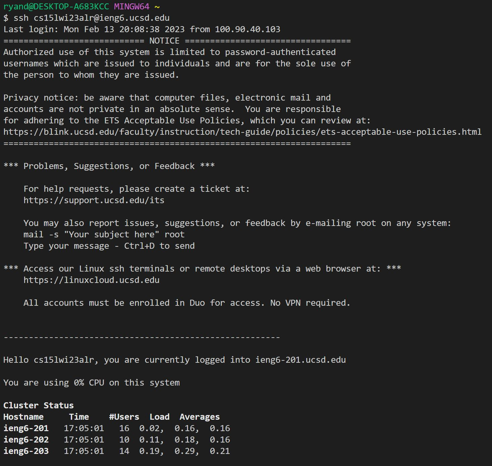    
Then, whilst in the current working directory, do `rm -rf l<tab><Enter>` in order to remove the `lab7/` directory from your SSH. By typing out just the letter l and then pressing `<tab>`, it autocompletes the directory your are trying to delete, saving a few seconds that may add up in the process. The `-rf` operator serves to a. recursively remove all files within the directory being removed and to b. forcefully remove the directory, as it will prompt you with a warning unless otherwise specified with -f.  
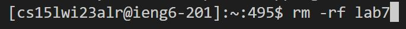  
After all this, you should type `logout` to logout of your SSH in order to continue to prepare for the competition, with the next steps being browser preparation.    
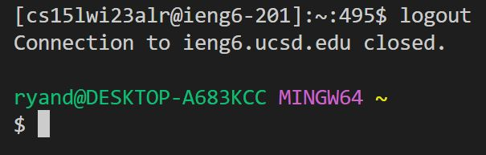  
### 2. (Setup) Fork the repository  
Again, very easily done by going to [this](https://github.com/ucsd-cse15l-w23/lab7) link and clicking the fork button, as can be seen on the screen circled in red.   
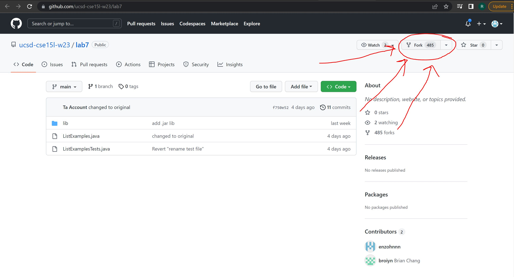  
### 3. (The real deal) Set the timer  
Nothing too special with this step, for me it is as easy as searching up 'stopwatch' on Google and readying up to start the competition. Refer to the image for extra guidance:  
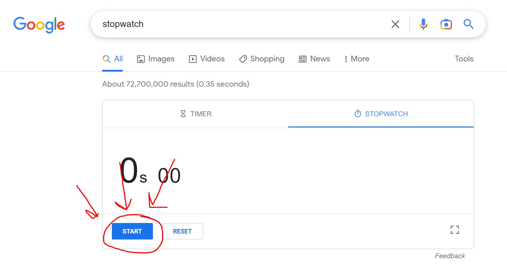    
### 4. Log into ieng6  
If you did not need to setup your SSH in the first few steps, you may just need to manually type out `ssh cs15lwi23xxx@ieng6.ucsd.edu<Enter>` for the first time. However, if you have done steps 1-3 religiously, there is a shortcut way to pull up the login command again, simply by pressing the `<up><Enter>` arrow key as it gets the history of all commands done by the user in a specific instance. Since the last command done while logged out of the SSH was the login command, you only need to press the up arrows once instead of a few different times.  
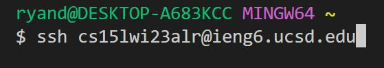  
### 5. Clone your fork of the repository into your Github account 
While this has been done before with `git clone [URL]<Enter>`, an alternative way to do this would be to go onto the Github repository for YOUR PERSONAL FORK of lab7/, clicking the `Code` button, selecting `SSH` and hitting the copy symbol next to the password-protected SSH key:  
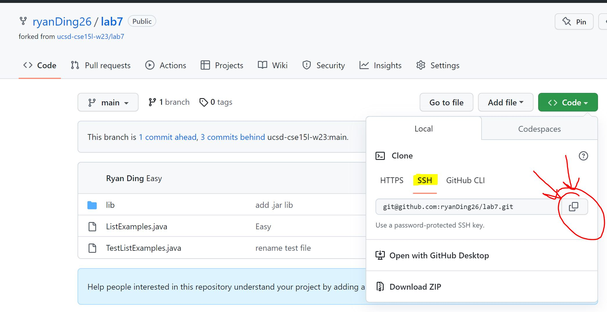    
This is all under the pretense that the pre-lab preparations were done beforehand that linked Github to your SSH with a key. Now you can execute the command to clone the fork of the repository by typing `git clone <Ctrl + V>` as a way to shorten the process of cloning.  
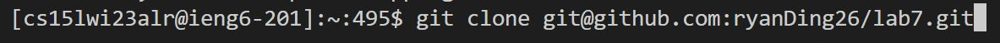  
### 6. Run the tests, demonstrating that they fail
Instead of going through various stages of pressing tab to access the specific JUnit and Hamcrest files needed to run the Tester, I myself prefer to go to Professor Politz' [Week 3](https://ucsd-cse15l-w23.github.io/week/week3/#setuphttps://ucsd-cse15l-w23.github.io/week/week3/#setup) CSE 15L page, click `Setup` on the side bar, scroll down an inch or so, and copy the commands using `<Ctrl + C>` he has located on there:  
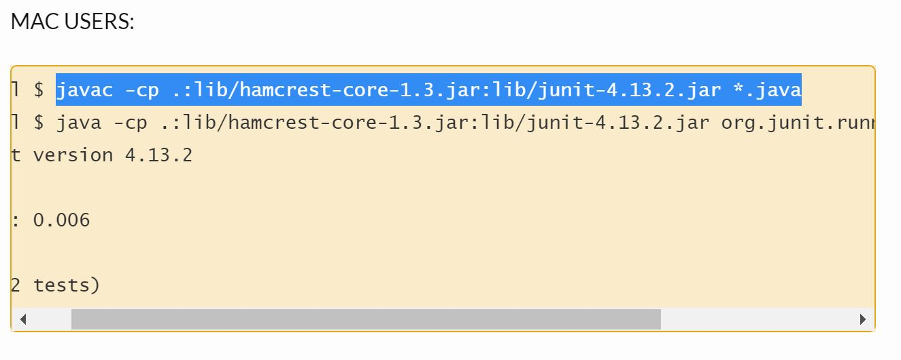    
However, before all else, change your directory into that of the lab7 directory with `cd l<Tab><Enter>`:  
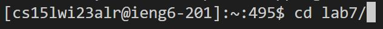  
It is important to highlight the commands listed under MAC USERS and that, when you highlight the second line to run the tester, you omit the ending file `ArrayTests` and instead add your own file name, which in this case is `TestListExamples`. However, if you want an even easier time in doing the competition, you can copy and paste the commands that I added below for ease: 
`javac -cp .:lib/hamcrest-core-1.3.jar:lib/junit-4.13.2.jar *.java<Enter>` or simply `<Ctrl + V><Enter>` after it is copied
`java -cp .:lib/hamcrest-core-1.3.jar:lib/junit-4.13.2.jar org.junit.runner.JUnitCore ListExamples` or simply `<Ctrl + V><Backspace x10>L<Tab>Tests<Enter>`. Alternatively, if you did not decide to copy the `ArrayTests` at the end of the command, it is just `<Ctrl + V>L<Tab>Tests<Enter>`.  
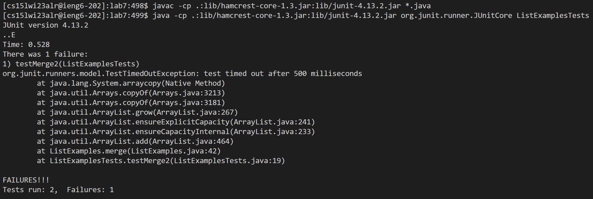    
As we can see, one of the tests failed, prompting us to fix the code in the next step.  
### 7. Edit the code file to fix the failing test  
In order to enter the mode for editing a file from the Git Bash terminal, you must use the `nano` command, as it allows you to directly enter and edit a file. We must enter ListExamples.java to edit the code so that the tests are able to pass and the shortest way to type this is by doing `nano L<Tab>.java`:  
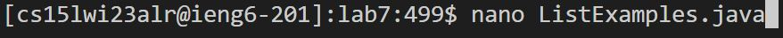    
From here, the change that needs to be made is on Line 43 of the code, where `index1` should really be `index2`:  
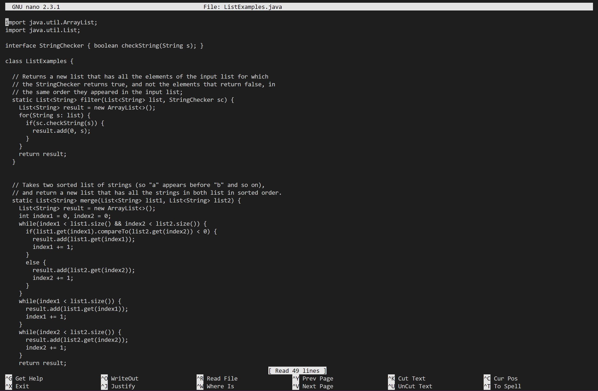    
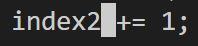  
The exact keys to type to get to the location of code needed to be changed and to change it is `<down x42><right x12><Backspace>2`. After this, you can do Ctrl + X to exit out of the nano menu, but you should press the letter y and enter in order to first save the changes made to the file and confirm that the file name to write is unchanged from ListExamples.java. To sum it up, the exact keys that need to be pressed are `<Ctrl + X>Y<Enter>`.  
### 8. Run the tests, demonstrating that they now succeed 
As the commands have already been done before, simply press `<up><up><up><Enter>` to compile the tester once more and `<up><up><up><Enter>` to run the tester once more to demonstrate how it passes now.  
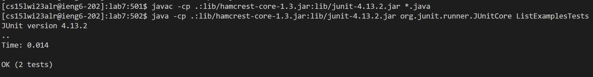  
### 9. Commit and push the resulting change to your Github account  
From here on forward, it is just three short statements that can already be typed up rather quickly:  
`git add .`  
`git commit -m "Done"`  
`git push`  
This produces this such screen to indicate that the changes made via `nano` were added to a commit and pushed towards the repository on Github:  
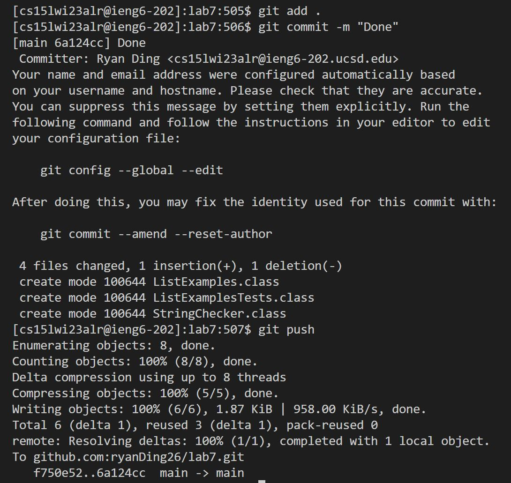    
Now, you may stop the timer and see how well you did on the competition!  
# Happy Coding!
