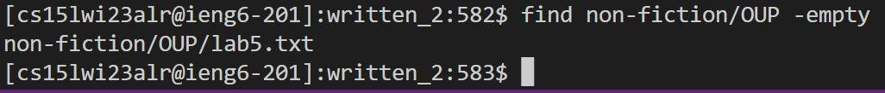

# CSE 15L Lab Report 5 | Ryan Ding
## Different ways to use `find` in bash
The find command, as its name suggests, allows for users to look for and potentially edit files via the Git Bash command line. Its syntax can normally be seen as follows:  
`find <<Working Directory>>`  
Note that when no directory is specified, the current working directory is used as a default. At its most basic level, it will print out the relative path of every file and directory under the working directory. However, this is not representative of how strong it actually is, and the options that it has makes it useful for a variety of purposes. In this lab report, we will once more be giong over the modifiers of a command within bash, similar to that of Lab Report 3.  
### 1. Finding the name of a specific file within a directory  
With the operator `-name`, individuals can specify for the name of a specific file or directory to be found. This is useful when you know that a file exists, but misplaced it inside a directory, and it makes it so much easier to change into its working directory or just to know its general location. The syntax is rather simple: 
`find <<Working Directory>> -name <<Name of file/directory>>`  
#### Example 1: Finding Vallarta-History.txt from written_2  
Let's say that I made and wrote a file on the history of Vallarta, but I had made so many directories that I lost it within the piles of txt files that I put into my directory. Using the find command, I am able to pinpoint its location and 
  
Command Syntax: `find -name Vallarta-History.txt`from within the `written_2` directory  
#### Example 2: Finding ch1.txt from nonfiction  

Command Syntax: `find written_2/nonfiction -name ch1.txt` from within the `written_2` directory  
### 2. Finding files that are entirely empty  
Using the `-empty` operator, we are able to find and print the relative path of every empty file or directory. In practicality, this serves to allow us to clean out the clutter that may build up as we play around with the command line and Git Bash more and more, since we can identify which files are empty and thus delete them as they serve no purpose. The syntax for finding empty files is:  
`find <<Working Directory>> -empty`
#### Example 1: Finding an empty directory I created within written_2
After creating an empty directory in written_2 using the simple `mkdir yeah` command (which will not be talked out in this report; just know that I made a new, empty directory), we are able to find its existance as an empty directory and then either add files or other directories inside of it for usage or to delete it entirely:  

  
Command Syntax: `find -empty` from within the `written_2` directory
#### Example 2: Finding an empty file I created within OUP

  
Command Syntax: `find nonfiction/OUP -empty` from within the `written_2` directory  
Note that I specified the directory in this example so as to avoid the output of the paths of other empty files I may have created.
### 3. Finding files that are newer than one specified
Each file has lots of metadata, including the date it was modified and created. Using the `-new` option, find is able to find all file and directories newer than the one specified, with this syntax:  
`find <<Working Directory>> -newer <<File of comparison>>`  
This is exceptionally useful for cases where the date of a file is important, such as if you recently downloaded malware on accident and need to see which files are new on your device
#### Example 1: Finding files newer than the Abernathy directory
Using the find command within a directory, we can find the files that were modified or created after the creation of Abernathy. Since all files within the Abernathy directory were modified (via placement into the Abernathy directory), all that it outputted is the files within Abernathy:  

Command Syntax: ``
#### Example 2: Finding files newer than the lab5.txt file I created in 2.2

Command Syntax: ``
### 4. Finding files owned by a specific user  

#### Example 1: Finding files I (cs15lwi23alr) created within Berk  

Command Syntax: ``
#### Example 2 (Outside written_2): Seeing if some username exists within ieng6  
This is the only sample that will go outside the scope of the written_2 directory because of the confines of this option. After SSHing into my ieng6 account and performing `cd ..`, it places me within the parent directory of the file named `cs15lwi23`, which harbors all users within the CSE 15L course. By performing the find command with the `-user` option, it allows me to check for a directory (in this case identifical to someone's username) that may exist, proving their existance within CSE 15L:  

  
Command Syntax: `find -user`
###### Sources Used: [Libre Texts](https://eng.libretexts.org/Bookshelves/Computer_Science/Operating_Systems/Linux_-_The_Penguin_Marches_On_(McClanahan)/05%3A_File_and_Directory_Management/2.05%3A_Searching_for_Files_on_Linux/2.05.01%3A_Searching_for_Files_on_Linux_-_find_Command#:~:text=The%20find%20Command,-The%20find%20command&text=It%20can%20be%20used%20to,on%20files%20or%20folders%20found.)  
# Happy Coding! Please give me full points :O
