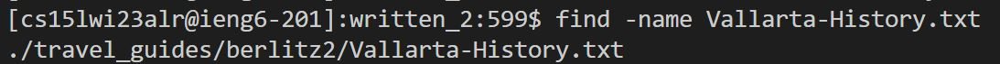
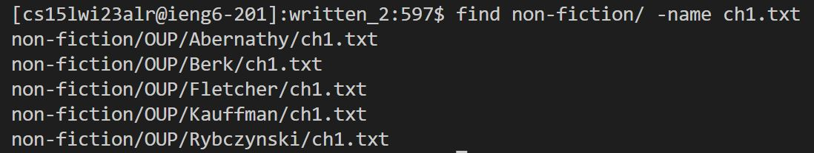
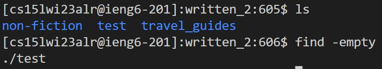
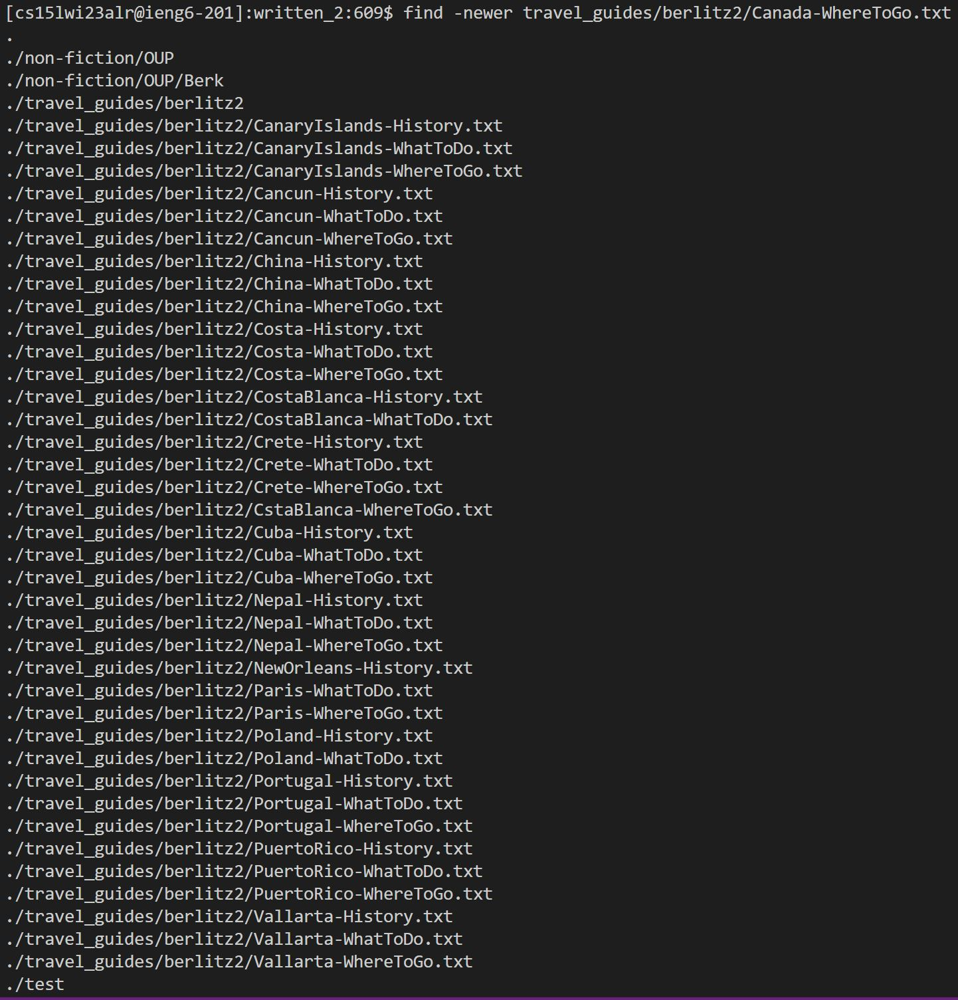
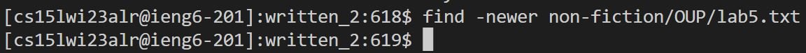
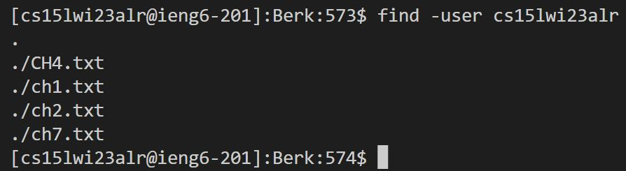
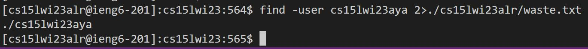

# CSE 15L Lab Report 5 | Ryan Ding
## Different ways to use `find` in bash
The find command, as its name suggests, allows for users to look for files or directories via the Git Bash command line. Its syntax can normally be seen as follows:  
`find <<Working Directory>>`  
*Note that when no directory is specified, the current working directory is used as a default.*  
At its most basic level, it will print out the relative path of every file and directory under the working directory. However, this is not representative of how strong it actually is, and the options that it has makes it useful for a variety of purposes. In this lab report, we will once more be going over the modifiers of a command within bash, similar to that of [Lab Report 3](https://github.com/ryanDing26/cse15l-lab-reports/tree/main/lab3).  

### 1. Finding the name of a specific file within a directory  
With the operator `-name`, individuals can specify for the name of a specific file or directory to be found. This is useful when you know that a file exists, but misplaced it inside a directory, and it makes it so much easier to change into its working directory or just to know its general location. The syntax is rather simple:   
`find <<Working Directory>> -name <<Name of file/directory>>`  

#### Example 1: Finding Vallarta-History.txt from written_2  
Let's say that I made and wrote a file on the history of Vallarta, but I had made so many directories that I lost it somewhere. Using the find command, I am able to pinpoint its location and find it to once more perform whatever devious activities I want on it:  
    
Command Syntax: `find -name Vallarta-History.txt`from within the `written_2` directory  

#### Example 2: Finding all ch1.txt files from non-fiction  
Alternatively, let's say that I have multiple textbooks on my computer, separated in txt files by the chapter. What if I wanted to see how many ch1.txt files exist? By using the `-name` option, I am able to clearly see just how many ch1.txt files that I have, as well as their relative paths:  
    
Command Syntax: `find written_2/non-fiction -name ch1.txt` from within the `written_2` directory  

### 2. Finding files that are entirely empty  
Using the `-empty` operator, we are able to find and print the relative path of every empty file or directory. In practicality, this is useful to clean out the clutter that may build up as we play around with the command line and Git Bash, since we can identify and delete files and directories that are empty within our system. The syntax for finding empty files is:  
`find <<Working Directory>> -empty`

#### Example 1: Finding an empty directory I created within written_2
After creating an empty directory in written_2 using the simple `mkdir test` command (which will not be talked out in this report; just know that I made a new, empty directory), we are able to find its existance as an empty directory and then determine its fate of deletion or usage (Spoiler alert: I do neither, it just sits there):  

    
Command Syntax: `find -empty` from within the `written_2` directory

#### Example 2: Finding an empty file I created within OUP
From the written_2 directory, I went ahead and created an empty txt file called lab5.txt using `touch non-fiction/OUP/lab5.txt` from the `written_2` directory. After this, I used the `-empty` option to see if it would be able to detect the empty txt file, which it did successfully:  
    
Command Syntax: `find non-fiction/OUP -empty` from within the `written_2` directory  
*Note that I specified the directory in this example so as to avoid the output of the paths of other empty files I may have created.*

### 3. Finding files that are newer than one specified
Each file has lots of metadata, including the date it was modified and created. Using the `-new` option, find is able to find all file and directories newer than the one specified, with this syntax:  
`find <<Working Directory>> -newer <<File of comparison>>`  
This is exceptionally useful for cases where the date of a file is important, such as if you recently downloaded malware on accident and need to see which files are new on your device after a specific file was downloaded.

#### Example 1: Finding files newer than the Canada-WhereToGo.txt file
Suppose I made all the txt files by hand, and that I stopped working one night while another person added more and more txt files in the morning. In order to discern which ones were made newly after I stopped working, which was right after I finished the Canada-WhereToGo.txt file, I can use the `-newer` option to see the names of the files created after my Canada file:
  
Command Syntax: `find -newer travel_guides/berlitz2/Canada-WhereToGo.txt` from within the `written_2` directory  

#### Example 2: Finding files newer than the lab5.txt file I created in 2.2
What if I made a new file, and was overly paranoid on if it may have produced anything else? Using the `-newer` option once more, I can check which files or directories have been modified after the creation of the lab5.txt file I had previously made in Example 2.2. Since I did not create or modify anthing else after I created lab5.txt, nothing should appear, which is correct: 
  
Command Syntax: `find -newer non-fiction/OUP/lab5.txt` from within the `written_2` directory

### 4. Finding files owned by a specific user  
What if you were not the only user that made files within a directory? With the `-user` command, you can specify to see the relative paths towards files owned by a specific user, useful for indicating who added each specific file within a directory. The syntax for this command is as follows:  
`find <<Working Directory>> -user <<Username of creator>>`  
This can serve useful to separate the files and directories you may have added towards a shared directory from those that others have added so that you can identify which files you made and potentially should be working within.  

#### Example 1: Finding files I (cs15lwi23alr) created within Berk  
In this example, we are going to find out which files that I created within Berk. Given that this is my ieng6 account, and that I cloned the written_2 directory into it along with its subdirectories, I actually own every single file within Berk, and the output is reflective of that:  
  
Command Syntax: `find -user cs15lwialr` from within the `written_2/non-fiction/OUP/Berk` directory  

#### Example 2 (Outside written_2): Seeing if some username exists within ieng6  
This is the only sample that will go outside the scope of the written_2 directory because of the confines of this option. After SSHing into my ieng6 account and performing `cd ..`, it places me within the parent directory of the file named `cs15lwi23`, which harbors all users within the CSE 15L course. By performing the find command with the `-user` option, it allows me to check for a directory (in this case identifical to someone's username) that may exist, proving their existance within CSE 15L (Note that this was not done with intention to harm others):  

  
Command Syntax: `find -user cs15lwi23aya`  from within the parent directory of `cs15lwi23alr`
*Note that the `2>./cs15lwi23alr/waste.txt` was the way for the command line to redirect all the "Permission Denied" errors that went into the output into a .txt file for readability in this report.*    

###### Sources Used: [Libre Texts](https://eng.libretexts.org/Bookshelves/Computer_Science/Operating_Systems/Linux_-_The_Penguin_Marches_On_(McClanahan)/05%3A_File_and_Directory_Management/2.05%3A_Searching_for_Files_on_Linux/2.05.01%3A_Searching_for_Files_on_Linux_-_find_Command#:~:text=The%20find%20Command,-The%20find%20command&text=It%20can%20be%20used%20to,on%20files%20or%20folders%20found.)  
# Happy Coding!
